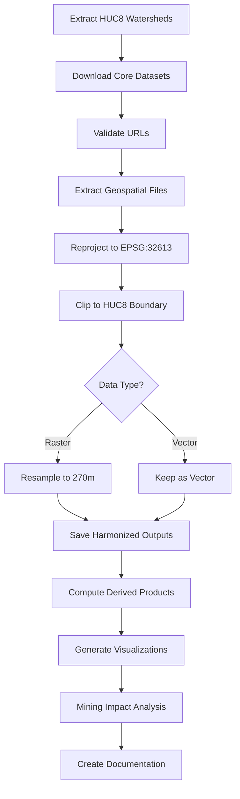

# Black Hills Hydrology and Mining Impacts Analysis - Project Plan

## Project Overview

**Region**: Black Hills, South Dakota (watershed-based boundary using HUC8)  
**Focus**: Hydrology, water resources, and potential mining impacts  
**Target CRS**: EPSG:32613 (UTM Zone 13N)  
**Target Resolution**: 270 meters  
**Output Directory**: `workflows/black_hills_hydrology/output/`

---

## Research Context

The Black Hills region is a critical water source for South Dakota, with complex hydrology influenced by elevation gradients, forest cover, and climate patterns. This analysis will harmonize multiple datasets to assess water resources and evaluate potential mining impacts on watersheds, water quality, and forest health. The analysis includes both 30-year climate normals (1991-2020) and recent decade trends (2012-2021) to understand long-term patterns and detect recent changes.

---

## Recommended Datasets

Based on your focus on hydrology, water resources, and mining impacts, here are the recommended datasets:

### Core Hydrology Datasets

### 1. **USGS 3D Hydrography Program (3DHP)** - Stream Networks and Waterbodies
- **Type**: Vector (flowlines, waterbodies, drainage areas)
- **URL**: `https://prd-tnm.s3.amazonaws.com/StagedProducts/Hydrography/3DHP/Annual/GPKG/3dhp_all_GPKG_FY26_CONUS_20260112/3dhp_all_CONUS_20260112_GPKG.zip`
- **Purpose**: Provides detailed stream networks and water features
- **Processing**: Keep as vector (rasterize=False) to preserve stream geometry
- **Notes**: Successor to NHD/NHDPlus High Resolution; large download but essential for hydrology

### 2. **USGS Watershed Boundary Dataset (WBD)** - Hydrologic Units
- **Type**: Vector (HUC boundaries)
- **URL**: `https://prd-tnm.s3.amazonaws.com/StagedProducts/Hydrography/WBD/National/GDB/WBD_National_GDB.zip`
- **Purpose**: Watershed boundaries at multiple scales (HUC8, HUC10, HUC12)
- **Processing**: Keep as vector to preserve watershed polygons
- **Notes**: ~2 GB download; will be clipped to Black Hills extent

### 3. **TerraClimate Monthly Water Balance** - Precipitation and Water Balance
- **Type**: Raster (STAC)
- **URL**: `https://planetarycomputer.microsoft.com/api/stac/v1`
- **Collection**: `terraclimate`
- **Assets**: 
  - `ppt` (precipitation)
  - `aet` (actual evapotranspiration)
  - `soil` (soil moisture)
  - `swe` (snow water equivalent)
- **Purpose**: Long-term climate and water balance variables (1958-2021)
- **Resolution**: ~4 km native, resampled to 270m
- **Processing**: Continuous data, use bilinear resampling
- **Time Periods**: 
  - 30-year normal: 1991-2020
  - Recent decade: 2012-2021

### 4. **National Land Cover Database (NLCD) 2024** - Land Cover
- **Type**: Raster (categorical)
- **URL**: `https://www.mrlc.gov/downloads/sciweb1/shared/mrlc/data-bundles/Annual_NLCD_LndCov_2024_CU_C1V1.zip`
- **Purpose**: Land cover affects runoff, infiltration, and water quality
- **Processing**: Categorical data, use nearest-neighbor resampling
- **Notes**: Important for understanding watershed characteristics

### 5. **Digital Elevation Model (DEM)** - Topography ✓ CONFIRMED
- **Type**: Raster
- **Source**: USGS 3DEP via STAC
- **URL**: `https://planetarycomputer.microsoft.com/api/stac/v1`
- **Collection**: `3dep-seamless`
- **Asset**: `data`
- **Purpose**: Elevation data for slope, aspect, flow direction, and watershed delineation
- **Resolution**: 30m native (will be resampled to 270m)
- **Processing**: Continuous data, use bilinear resampling
- **Notes**: Critical for understanding topographic controls on hydrology and mining site locations
- **Derived Products**: Will compute slope and aspect from DEM

### Mining Impact Datasets

### 6. **EPA Uranium Mine Locations** ✓ CONFIRMED
- **Type**: Vector (points/polygons)
- **URL**: `https://www.epa.gov/sites/default/files/2015-03/uld-ii_gis.zip`
- **Purpose**: Historical uranium mine locations to assess proximity to water resources
- **Processing**: Keep as vector or rasterize to show mining density
- **Notes**: Black Hills has significant historical mining activity; critical for impact assessment

### 7. **EPA Air Quality Index by County** (Optional)
- **Type**: Tabular (CSV)
- **URL**: `https://aqs.epa.gov/aqsweb/airdata/annual_aqi_by_county_2022.zip`
- **Purpose**: Air quality data that may correlate with mining/industrial activity
- **Processing**: Join to county boundaries
- **Notes**: Can provide context for environmental impacts

### Forest Cover Datasets

### 8. **Hansen Global Forest Change 2024 - Tree Cover 2000** ✓ CONFIRMED
- **Type**: Raster
- **URL**: `https://storage.googleapis.com/earthenginepartners-hansen/GFC-2024-v1.12/Hansen_GFC-2024-v1.12_treecover2000_50N_110W.tif`
- **Purpose**: Baseline forest cover (year 2000)
- **Processing**: Continuous data (percent canopy), use bilinear resampling
- **Notes**: Black Hills is in tile 50N_110W; important for understanding vegetation effects on water

### 9. **Hansen Global Forest Change 2024 - Loss Year** ✓ CONFIRMED
- **Type**: Raster
- **URL**: `https://storage.googleapis.com/earthenginepartners-hansen/GFC-2024-v1.12/Hansen_GFC-2024-v1.12_lossyear_50N_110W.tif`
- **Purpose**: Year of forest loss (2001-2024)
- **Processing**: Categorical data, use nearest-neighbor resampling
- **Notes**: Track deforestation that may relate to mining, logging, or development

### Streamflow and Water Quality Data

### 10. **USGS Stream Gages - National Water Dashboard** ✓ CONFIRMED
- **Type**: Vector (point locations with time series data)
- **API URL**: `https://waterservices.usgs.gov/nwis/iv/` (Instantaneous Values)
- **API URL**: `https://waterservices.usgs.gov/nwis/dv/` (Daily Values)
- **API URL**: `https://waterservices.usgs.gov/nwis/site/` (Site Information)
- **API URL**: `https://waterservices.usgs.gov/nwis/wq/` (Water Quality)
- **Dashboard**: `https://dashboard.waterdata.usgs.gov/app/nwd/en/`
- **Purpose**: Real-time and historical streamflow measurements from USGS stream gages
- **Processing**:
  - Query gages within Black Hills HUC8 watersheds (10160002, 10160003)
  - Extract gage locations as point vector layer
  - Download streamflow statistics (mean, min, max, percentiles)
  - Can compute long-term statistics and recent trends
- **Key Parameters**:
  - Parameter code: `00060` (Discharge, cubic feet per second)
  - Format: `json` or `rdb` (tab-delimited)
  - Time period: Match climate periods (1991-2020, 2012-2021)
- **Notes**:
  - USGS NWIS (National Water Information System) provides comprehensive streamflow data
  - Can correlate streamflow with precipitation, forest cover, and mining locations
  - Useful for validating hydrologic models and assessing water availability
  - National Water Dashboard provides interactive visualization and data access

### 11. **USGS Water Quality - pH Measurements** ✓ CONFIRMED
- **Type**: Vector (point locations with water quality time series)
- **API URL**: `https://waterservices.usgs.gov/nwis/wq/` (Water Quality)
- **Purpose**: pH measurements as an indicator of watershed health and mining impacts
- **Processing**:
  - Query water quality stations within Black Hills HUC8 watersheds
  - Extract pH statistics (mean, min, max, standard deviation)
  - Identify stations with abnormal pH values (potential contamination)
  - Correlate pH with proximity to mining sites
- **Key Parameters**:
  - Parameter code: `00915` (pH, standard units)
  - Additional water quality parameters available:
    - `00931` (Specific conductance, microsiemens/cm)
    - `00010` (Temperature, water, Fahrenheit)
    - `00631` (Nitrate+nitrite as N, mg/L)
    - `00630` (Nitrate as N, mg/L)
    - `00664` (Phosphate as P, mg/L)
    - `00600` (Sediment, total, mg/L)
  - Format: `json` or `rdb` (tab-delimited)
  - Time period: Match climate periods (1991-2020, 2012-2021)
- **Notes**:
  - pH is a critical indicator of acid mine drainage and water quality
  - Normal stream pH ranges from 6.5-8.5; values outside this range may indicate contamination
  - Mining activities can lower pH through acid rock drainage
  - USGS NWIS water quality database provides historical and recent measurements
  - Can be correlated with uranium mine locations to assess mining impacts

### 12. **USGS Streamflow Statistics** (Derived from gage data)
- **Type**: Vector (point attributes) or Raster (interpolated)
- **Source**: Computed from NWIS API data
- **Purpose**: Statistical summaries of streamflow for each gage
- **Metrics to Compute**:
  - Mean annual flow (30-year normal vs. recent decade)
  - 7-day low flow (drought indicator)
  - Peak flow statistics (flood risk)
  - Flow duration curves
  - Trend analysis (increasing/decreasing flows)
- **Processing**:
  - Keep as vector points with attributes
  - Optionally interpolate to raster using kriging or IDW
  - Join to stream network for visualization
- **Notes**: Provides ground-truth data for water availability assessment

---

## Region Definition

### Black Hills Boundary - Watershed-Based Approach ✓ CONFIRMED

**Approach**: Use HUC8 watersheds that cover the Black Hills region in South Dakota

**Primary HUC8 Watersheds**:
- **Cheyenne** (10160002) - Major watershed draining the southern Black Hills
- **Belle Fourche** (10160003) - Northern Black Hills watershed
- **Rapid Creek** (partial) - Central Black Hills urban watershed

**Rationale**: Watershed-based boundaries provide hydrologic coherence, ensuring that water flow patterns are captured within the analysis extent. This is critical for assessing mining impacts on water resources, as contaminants follow watershed boundaries.

**Implementation**: Extract HUC8 polygons from the USGS Watershed Boundary Dataset (WBD) and use as the clip boundary.

---

## Workflow Architecture



---

## Technical Specifications

### Coordinate Reference System
- **EPSG:32613** (WGS 84 / UTM Zone 13N)
- Units: meters
- Preserves distance and shape for the Black Hills region
- Suitable for hydrologic analysis requiring accurate distances

### Spatial Resolution
- **270 meters** (consistent with Colorado/Utah examples)
- Good balance between detail and processing efficiency
- Appropriate for regional watershed analysis

### Resampling Methods
- **Categorical data** (NLCD, Hansen loss year): `resampling_method="nearest"`
- **Continuous data** (precipitation, ET, soil moisture, DEM, tree cover): `resampling_method="bilinear"`

### Clipping Strategy
- Use `clip_boundary` parameter with HUC8 watershed polygons
- Extract HUC8 codes 10160002 and 10160003 from WBD
- Merge polygons to create single study area boundary

---

## Output Files

All outputs will be saved to `workflows/black_hills_hydrology/output/`:

### Raster Outputs (GeoTIFF)

**Climate - 30-Year Normal (1991-2020)**:
- `harmonized_terraclimate_ppt_30yr.tif` - Mean annual precipitation
- `harmonized_terraclimate_aet_30yr.tif` - Mean actual evapotranspiration
- `harmonized_terraclimate_soil_30yr.tif` - Mean soil moisture
- `harmonized_terraclimate_swe_30yr.tif` - Mean snow water equivalent

**Climate - Recent Decade (2012-2021)**:
- `harmonized_terraclimate_ppt_recent.tif` - Recent mean annual precipitation
- `harmonized_terraclimate_aet_recent.tif` - Recent mean actual evapotranspiration
- `harmonized_terraclimate_soil_recent.tif` - Recent mean soil moisture
- `harmonized_terraclimate_swe_recent.tif` - Recent mean snow water equivalent

**Land Cover and Topography**:
- `harmonized_nlcd_2024.tif` - Land cover classification
- `harmonized_dem.tif` - Digital elevation model
- `harmonized_slope.tif` - Slope (derived from DEM)
- `harmonized_aspect.tif` - Aspect (derived from DEM)

**Forest Cover**:
- `harmonized_hansen_treecover2000.tif` - Baseline tree cover (year 2000)
- `harmonized_hansen_lossyear.tif` - Year of forest loss (2001-2024)
- `harmonized_forest_loss_density.tif` - Forest loss density (derived)

### Vector Outputs (GeoJSON)

**Hydrology**:
- `harmonized_3dhp_flowlines.geojson` - Stream networks
- `harmonized_3dhp_waterbodies.geojson` - Lakes and reservoirs
- `harmonized_wbd_huc8.geojson` - HUC8 watersheds (study area boundary)
- `harmonized_wbd_huc10.geojson` - HUC10 sub-watersheds
- `harmonized_wbd_huc12.geojson` - HUC12 micro-watersheds

**Mining**:
- `harmonized_uranium_mines.geojson` - Uranium mine locations
- `harmonized_mines_buffered_1km.geojson` - 1km buffer zones around mines
- `harmonized_mines_buffered_5km.geojson` - 5km buffer zones around mines

**Water Quality**:
- `harmonized_usgs_gages.geojson` - USGS stream gage locations with attributes
- `harmonized_streamflow_stats.geojson` - Gage locations with flow statistics
- `harmonized_water_quality_ph.geojson` - pH measurement stations with statistics
- `harmonized_water_quality_conductivity.geojson` - Specific conductance stations

### Visualizations
- `harmonized_visualization.png` - Multi-panel static map (required filename)
- `harmonized_visualization.html` - Interactive Folium map

---

## Implementation Steps

### Step 1: Validate Dataset URLs
```bash
python scripts/check_urls.py \
  "https://prd-tnm.s3.amazonaws.com/StagedProducts/Hydrography/3DHP/Annual/GPKG/3dhp_all_GPKG_FY26_CONUS_20260112/3dhp_all_CONUS_20260112_GPKG.zip" \
  "https://prd-tnm.s3.amazonaws.com/StagedProducts/Hydrography/WBD/National/GDB/WBD_National_GDB.zip" \
  "https://www.mrlc.gov/downloads/sciweb1/shared/mrlc/data-bundles/Annual_NLCD_LndCov_2024_CU_C1V1.zip" \
  "https://www.epa.gov/sites/default/files/2015-03/uld-ii_gis.zip" \
  "https://storage.googleapis.com/earthenginepartners-hansen/GFC-2024-v1.12/Hansen_GFC-2024-v1.12_treecover2000_50N_110W.tif" \
  "https://storage.googleapis.com/earthenginepartners-hansen/GFC-2024-v1.12/Hansen_GFC-2024-v1.12_lossyear_50N_110W.tif"

# Note: USGS NWIS API endpoints are queried programmatically, not downloaded as files
```

### Step 1b: Query USGS Stream Gages
```bash
# Example API query for gages in HUC8 10160002 (Cheyenne)
# https://waterservices.usgs.gov/nwis/site/?format=rdb&huc=10160002&siteType=ST&siteStatus=all

# This will be done programmatically in the Python script
```

### Step 2: Create Workflow Directory
```bash
mkdir -p workflows/black_hills_hydrology/output
```

### Step 3: Write Harmonization Script
Create `workflows/black_hills_hydrology/black_hills_harmonization.py` following the pattern from Colorado/Utah examples.

Key script components:
- Extract HUC8 watersheds (10160002, 10160003) from WBD
- Define two TerraClimate time periods (30-yr and recent decade)
- Include all confirmed datasets
- Set `clip_boundary` to merged HUC8 polygons
- Generate derived products (slope, aspect, mine buffers)

### Step 4: Run Harmonization
```bash
nohup python workflows/black_hills_hydrology/black_hills_harmonization.py > workflows/black_hills_hydrology/output/run.log 2>&1 &
```

Monitor progress:
```bash
# Check status files
ls -lh workflows/black_hills_hydrology/output/*.status

# View log
tail -f workflows/black_hills_hydrology/output/run.log
```

### Step 5: Document Results
- Update `PROMPT_ACTION_LOG.md` with date, prompt, model, and actions
- Create `docs/workflows/black_hills_hydrology.md` following Utah example format
- Add any new datasets to `data_catalog.yml` (if URLs pass health check)

---

## Key Decisions - CONFIRMED ✓

### 1. Region Boundary Definition ✓
**Decision**: Watershed-based (HUC8) for hydrologic coherence
- Cheyenne (10160002)
- Belle Fourche (10160003)

### 2. TerraClimate Time Periods ✓
**Decision**: Both 30-year normal (1991-2020) AND recent decade (2012-2021)
- Allows comparison of long-term baseline vs. recent conditions
- Can detect climate change signals and recent trends

### 3. Additional Datasets ✓
**Confirmed Additions**:
- ✓ Digital Elevation Model (DEM) for topographic analysis
- ✓ Forest cover (Hansen Global Forest Change) for vegetation effects
- ✓ EPA Uranium Mine locations for mining impact assessment

### 4. Vector vs. Raster for Streams ✓
**Decision**: Keep as vector for detailed hydrologic analysis
- Preserves stream geometry and connectivity
- Better for network analysis and proximity calculations

---

## Expected Outputs and Use Cases

### Analysis Capabilities
With the harmonized datasets, you will be able to:

1. **Watershed Characterization**
   - Delineate drainage areas at multiple scales (HUC8, HUC10, HUC12)
   - Calculate watershed statistics (area, perimeter, shape)
   - Analyze land cover composition by watershed
   - Compute topographic metrics (mean elevation, slope, aspect)

2. **Water Balance Analysis**
   - Compute precipitation inputs by watershed (30-yr vs. recent decade)
   - Estimate evapotranspiration losses
   - Assess soil moisture patterns and trends
   - Track snow water equivalent (critical for Black Hills water supply)
   - Detect climate change signals (compare 30-yr normal to recent decade)

3. **Stream Network and Flow Analysis**
   - Map stream density and distribution
   - Identify stream orders and connectivity
   - Locate waterbodies and reservoirs
   - Calculate distance from streams to mine sites
   - Analyze streamflow patterns from USGS gages
   - Compare streamflow between 30-year normal and recent decade
   - Identify gages with declining flows (potential water stress)
   - Assess streamflow proximity to mining sites

4. **Water Quality Assessment (pH)**
   - Map pH measurement stations across Black Hills watersheds
   - Calculate pH statistics (mean, min, max, standard deviation) by station
   - Identify stations with abnormal pH values (outside 6.5-8.5 range)
   - Correlate pH anomalies with proximity to uranium mines
   - Assess temporal trends in pH (improving/degrading water quality)
   - Create pH interpolation map (kriging/IDW) to show spatial patterns
   - Evaluate acid mine drainage potential based on pH and geology

4. **Mining Impact Assessment**
   - Map mine locations relative to watersheds and streams
   - Identify downstream water resources potentially affected by mining
   - Calculate mine density by watershed
   - Create buffer zones around mines to assess affected areas
   - Correlate mine locations with water quality indicators (if available)
   - Assess proximity of mines to drinking water sources

5. **Forest-Hydrology Relationships**
   - Assess forest cover effects on water yield and quality
   - Track deforestation patterns (2001-2024)
   - Correlate forest loss with mining activity
   - Analyze vegetation effects on evapotranspiration and infiltration
   - Identify areas where forest loss may increase erosion and sedimentation

6. **Topographic Controls**
   - Assess elevation effects on precipitation and temperature
   - Analyze slope effects on runoff and erosion potential
   - Identify steep slopes near mines (erosion risk)
   - Compute flow direction and accumulation for watershed delineation
   - Determine aspect effects on snow accumulation and melt

7. **Climate-Hydrology Trends**
   - Compare 30-year normal (1991-2020) to recent decade (2012-2021)
   - Identify areas with changing precipitation patterns
   - Assess drought vulnerability
   - Evaluate snow water equivalent trends (climate change indicator)
   - Detect shifts in water availability

### Visualization Examples
- **Multi-panel map**: Watersheds, streams, mine locations, elevation, forest cover, precipitation, stream gages, pH stations
- **Interactive map**: Layer toggles for all variables, clickable mine sites, stream gages, and pH stations with metadata
- **Mining impact map**: Mines overlaid on streams with buffer zones showing affected areas
- **Streamflow analysis**: Gage locations sized by flow magnitude, colored by trend (increasing/decreasing)
- **Water quality map**: pH stations colored by mean pH values, with symbols sized by standard deviation
- **pH anomaly map**: Stations with abnormal pH values (outside 6.5-8.5) highlighted with proximity to mines
- **Climate comparison**: Side-by-side 30-year normal vs. recent decade for all climate variables
- **Forest change map**: Tree cover 2000 vs. forest loss through 2024
- **Watershed summary statistics**: Tables and charts by HUC8/HUC10 including streamflow and pH data
- **Topographic analysis**: Elevation, slope, and aspect maps with mine locations and stream gages
- **Water availability map**: Precipitation, streamflow, and mining locations to assess water stress

---

## Potential Challenges and Solutions

### Challenge 1: Large File Downloads
**Issue**: 3DHP (~1.5 GB) and WBD (~2 GB) are large files  
**Solution**: Downloads are cached; subsequent runs are fast. Initial download may take 10-20 minutes.

### Challenge 2: HUC8 Watershed Extraction
**Issue**: Need to extract specific HUC8 watersheds from national WBD dataset  
**Solution**: Filter WBD by HUC8 codes (10160002, 10160003) and merge polygons for clip boundary.

### Challenge 3: STAC Data Access
**Issue**: TerraClimate and 3DEP require STAC API access  
**Solution**: The harmonizer supports STAC; ensure `is_stac=True` and specify collection/asset parameters.

### Challenge 4: Temporal Aggregation for Two Time Periods
**Issue**: TerraClimate has monthly data; need to compute means for two different time periods  
**Solution**: Run harmonization twice with different `stac_datetime` filters:
- 30-year normal: `1991-01-01/2020-12-31`
- Recent decade: `2012-01-01/2021-12-31`

### Challenge 5: Hansen Forest Data Tile Selection
**Issue**: Need to identify correct tile for Black Hills  
**Solution**: Black Hills is in tile 50N_110W. Verify coverage and download both treecover2000 and lossyear layers.

### Challenge 6: DEM Source Selection
**Issue**: Multiple DEM sources available (3DEP, SRTM, ASTER)  
**Solution**: Use USGS 3DEP via STAC (highest quality for US, 30m resolution). Collection: `3dep-seamless`.

### Challenge 7: Mine Buffer Zone Creation
**Issue**: Need to create buffer zones around mine points  
**Solution**: Use GeoPandas buffer() method after harmonization to create 1km and 5km buffers.

---

## Implementation Workflow

### Phase 1: Setup and Validation
1. Create workflow directory: `workflows/black_hills_hydrology/`
2. Validate all dataset URLs using `scripts/check_urls.py`
3. Extract HUC8 boundaries from WBD for study area definition

### Phase 2: Core Hydrology Harmonization
1. Download and harmonize WBD (HUC8, HUC10, HUC12)
2. Download and harmonize 3DHP (streams, waterbodies)
3. Download and harmonize DEM (and derive slope, aspect)
4. Download and harmonize NLCD 2024

### Phase 3: Climate Data (Two Time Periods)
1. TerraClimate 30-year normal (1991-2020): ppt, aet, soil, swe
2. TerraClimate recent decade (2012-2021): ppt, aet, soil, swe

### Phase 4: Forest Cover
1. Hansen tree cover 2000 (baseline)
2. Hansen loss year (2001-2024)

### Phase 5: Mining Data
1. EPA uranium mine locations
2. Create mine buffer zones (1km, 5km)

### Phase 6: Analysis and Visualization
1. Generate multi-panel static visualization
2. Create interactive map with all layers
3. Compute watershed-level statistics
4. Create mining impact proximity analysis

### Phase 7: Documentation
1. Update `PROMPT_ACTION_LOG.md`
2. Create `docs/workflows/black_hills_hydrology.md`
3. Add any new datasets to `data_catalog.yml`

---

## Summary of Confirmed Specifications

✓ **Region**: Black Hills, South Dakota - HUC8 watersheds (Cheyenne 10160002, Belle Fourche 10160003)  
✓ **Focus**: Hydrology, water resources, and mining impacts  
✓ **CRS**: EPSG:32613 (UTM Zone 13N)  
✓ **Resolution**: 270 meters  
✓ **Climate Periods**: 30-year normal (1991-2020) + Recent decade (2012-2021)  
✓ **Key Additions**: DEM, forest cover, uranium mine locations  
✓ **Analysis Goal**: Assess potential mining impacts on water resources

---

## Ready for Implementation

The plan is now complete and ready for implementation. The next step is to switch to Code mode to:

1. Create the workflow directory structure
2. Write the Python harmonization script with all specified datasets
3. Validate dataset URLs
4. Set up execution with nohup
5. Generate documentation

This analysis will provide comprehensive insights into Black Hills hydrology and enable assessment of potential mining impacts on water resources, forest health, and watershed integrity.

---

## References

- **AGENTS.md**: Repository rules and workflow patterns
- **TASKS.md**: Harmonization pipeline steps
- **data_catalog.yml**: Available datasets and metadata
- **Colorado example**: `examples/colorado_fire_risk/colorado_harmonization.py`
- **Utah example**: `workflows/utah_fire_risk/utah_harmonization.py`
